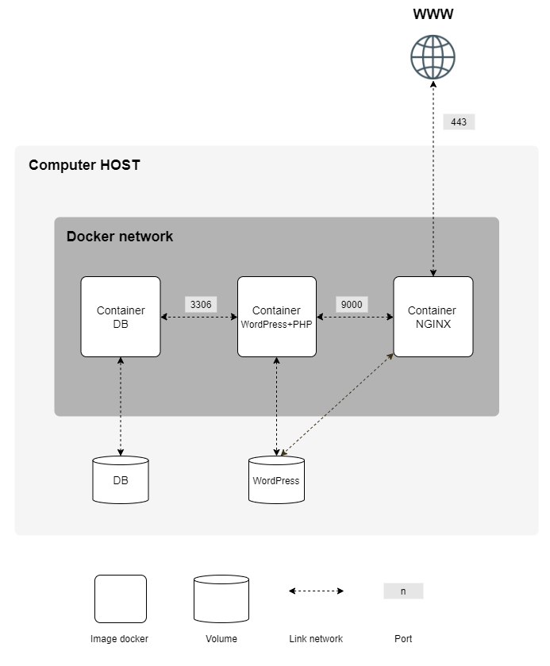

# `Inception`

This repository contains a compact infrastructure built on Docker and Docker-Compose, encompassing a robust LEMP Stack (Nginx, MariaDB, PHP) configuration to efficiently deploy WordPress. The setup adheres to specific guidelines, offering a hands-on approach to system administration through Docker utilization.

[Subject](img/en.subject.pdf)

    
    
    
    

    

## Project Components:
- **NGINX Container with TLS Support:**
  - Docker container exclusively configured to support TLSv1.2 or TLSv1.3.

- **WordPress and MariaDB Containers:**
  - Separate Docker containers for WordPress with php-fpm and MariaDB, excluding Nginx.

- **Volume Configuration:**
  - Allocation of volumes for the WordPress database and website files.

- **Networking:**
  - Establishment of a dedicated Docker network facilitating communication between containers.

- **Auto-Restart Mechanism:**
  - Automated container restarts in case of a crash for sustained system uptime.

- **Database User Configuration:**
  - Creation of two users in the WordPress database, with stringent criteria for the administrator's username.

- **Volume Mapping to Host Machine:**
  - Volumes mapped to the `/home/login/data` directory on the host machine for seamless access.

- **Domain Configuration:**
  - Custom domain setup (`login.42.fr`) directing to the local IP address for improved accessibility.
---
